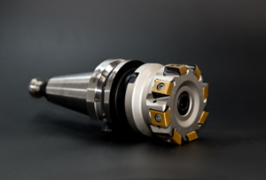
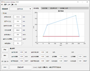
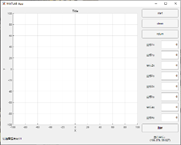
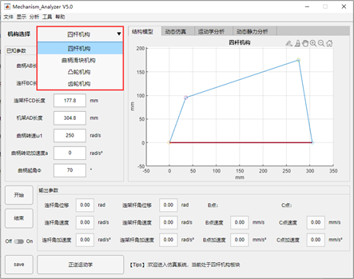
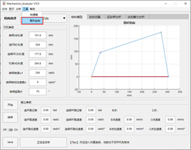
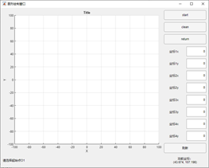
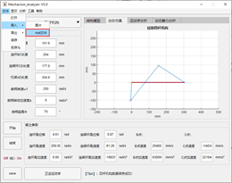
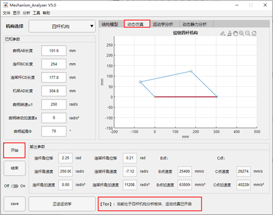

# **机构仿真运算终端系统操作手册**

**开发平台：App Designer**

**开发者：Demons**

**联系渠道：demons.zhao@outlook.com**

**版本号：V1.0**

**开发日期：2020.7.25**

## 一、机构仿真运算终端系统软件介绍

机构仿真运算终端系统是一款基于Matlab最新GUI开发平台app designer的机构分析软件。支持包括四杆机构、曲柄滑块机构、凸轮机构等机构运动仿真分析。可实时修改模型并运动仿真，导出运动线图数据流以及生成机构分析Microsoft Word报告模板，支持图片和Mat文件导入等功能，实现多机构的运动学分析。

### 1、以下是本系统的启动界面和软件图标

|  |  |
| :--------------------------------------------: | :----------------------------------------------------------: |

 
图1-1 启动界面及软件图标

###    2、以下是本系统的主窗口和子窗口界面

|  |  |  |
| :----------------------------------------------------------: | :--------------------------------------------: | :----------------------------------------------------------: |

图1-2 主窗口及子窗口环境

 

## 二、机构仿真运算终端系统软件使用流程

### 1、多机构选择

  双击机构仿真运算终端系统，进入软件主窗口环境，点击机构选择，选择所需分析机构。

 

图2-1 主窗口界面

### 2、确定已知参数

  对于分析机构，软件保有默认参数，用户根据实际需求，更改已知参数进行运动仿真，目前已开放的参数输入渠道有三种。

#### **1、** **参数列表框直接修改数值**

图2-2 参数数值输入

#### **2、** **手动线条绘制**

​    点击菜单栏中的“工具”选项，下拉选择进入“图形绘制”子窗口，

根据左下角的操作提示进行操作，同时右下角将实时显示光标坐标，辅助绘图。

|  |  |
| :--------------------------------------------: | :--------------------------------------------: |

图2-3 图形绘制子窗口

#### **3、** **Mat数据导入**

   **点击菜单栏的“文件”选项，在下拉框中选择“导入”下的“Mat文件”，选择本地文件夹下的Mat文件。**

 

|  |  |
| :--------------------------------------------: | :--------------------------------------------: |

图2-4 Mat数据导入

### 3、运行仿真及数据导出

####        **1、运行运动仿真**

​       点击主窗口下的“开始”按键，仿真开启，同时右下角显示Tips操作。仿真运动开启后，选择“运动仿真”一栏，观察运动动画，下方同时实时显示数据变化。

图2-5 运动仿真

​    同时左下方的其他按键可以实现，仿真暂停及仿真结束等功能。

图2-6 暂停和结束功能

####    **2、保存数据并导出分析报告**

​    点击“运动学分析”一栏，再点击左下角的“save”按键保存数据，之后点击菜单栏中的“文件”，在下拉框中选择导出为“Microsoft Word”。

|  |  |
| :----------------------------------------------------------: | :----------------------------------------------------------: |
|  |  |

图2-7 数据导出

## 三、机构仿真运算终端系统其他扩展功能

### 1、正逆运动学的四足运动分析

  本系统内置四足正逆运动学足端分析功能，对机构的分析进一步加强。

  点击主窗口下的“正逆运动学”，进入正逆运动学窗口。该窗口下，可对摆线方程6个参数进行滑动设置，操作流程与前章所述一致。

图3-1 正逆运动学分析

### 2、栅格显示

​    本系统目前支持坐标系的栅格显示修改，点击菜单栏的“显示”选项，在在下拉框中选择“网格显示”，可对系统中的坐标系栅格显示与否进行选择。

|  |  |
| :----------------------------------------------------------: | :----------------------------------------------------------: |

图3-2 栅格显示

### 3、帮助系统

  本系统为后续优化改进及用户使用疑问提供有效渠道和帮助。点击菜单栏中的“帮助”选项，有“帮助文档”及“app开发”选项，点进“帮助文档”可进入User Documents 文档（pdf）。

|  |  |
| :----------------------------------------------------------: | :----------------------------------------------------------: |

 
图3-3 帮助文档

  同时开放开发者的相关联系方式，方便用户联系作者，提供功能修整及答疑活动。

|  |  |
| :----------------------------------------------------------: | :----------------------------------------------------------: |

图3-4 联系方式

# 注

**功能代码尚不完整，仅供参考，欢迎留言交流**

